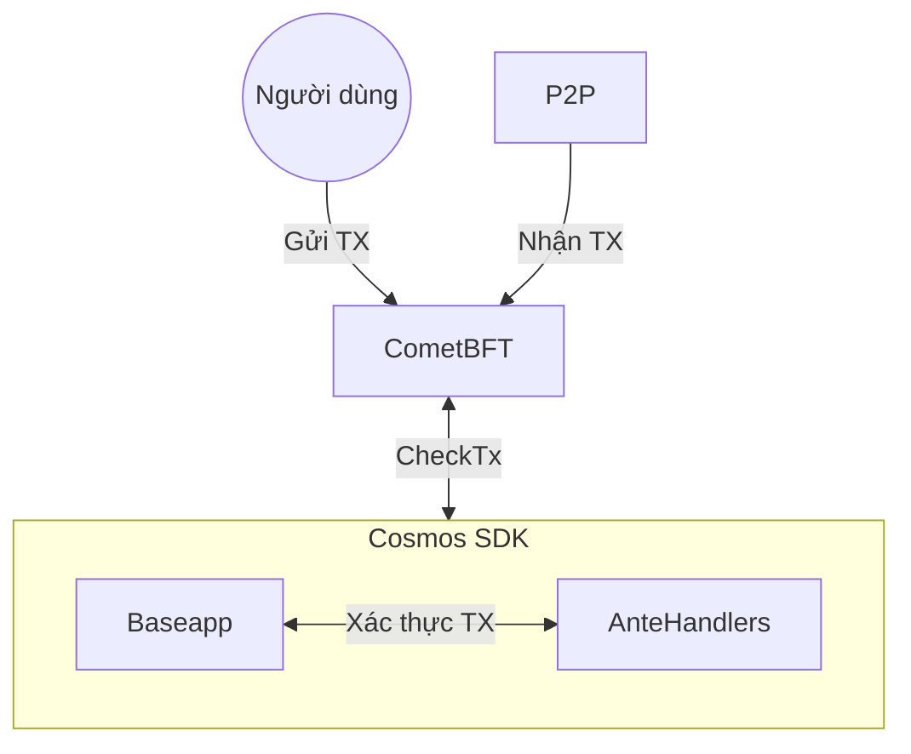

# CheckTx

CheckTx được gọi bởi `BaseApp` khi CometBFT nhận được giao dịch từ client, qua mạng p2p hoặc RPC. Phương thức CheckTx chịu trách nhiệm xác thực giao dịch và trả về lỗi nếu giao dịch không hợp lệ.



```go reference
https://github.com/cosmos/cosmos-sdk/blob/31c604762a434c7b676b6a89897ecbd7c4653a23/baseapp/abci.go#L350-L390
```

## CheckTx Handler

`CheckTxHandler` cho phép người dùng mở rộng logic của `CheckTx`. `CheckTxHandler` được gọi bằng cách truyền context và các byte giao dịch nhận được qua ABCI. Yêu cầu rằng handler phải trả về kết quả xác định (deterministic) với cùng một chuỗi byte giao dịch.

:::note
Chúng ta trả về giao dịch đã được giải mã thô ở đây để tránh phải giải mã hai lần.
:::

```go
type CheckTxHandler func(ctx sdk.Context, tx []byte) (Tx, error)
```

Việc đặt `CheckTxHandler` tùy chỉnh là tùy chọn. Nó có thể được thực hiện từ file app.go của bạn:

```go
func NewSimApp(
	logger log.Logger,
	db corestore.KVStoreWithBatch,
	traceStore io.Writer,
	loadLatest bool,
	appOpts servertypes.AppOptions,
	baseAppOptions ...func(*baseapp.BaseApp),
) *SimApp {
  ...
  // Tạo ChecktxHandler
  checktxHandler := abci.NewCustomCheckTxHandler(...)
  app.SetCheckTxHandler(checktxHandler)
  ...
}
```
