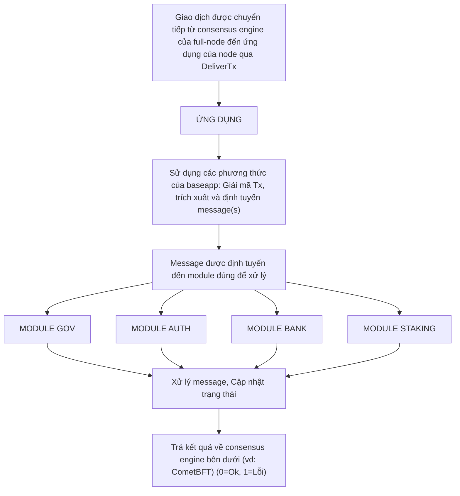

# Giới Thiệu về Cosmos SDK Modules

:::note Tóm tắt
Các module định nghĩa phần lớn logic của các ứng dụng Cosmos SDK. Nhà phát triển kết hợp các module lại với nhau bằng Cosmos SDK để xây dựng các blockchain tùy chỉnh theo từng ứng dụng. Tài liệu này trình bày các khái niệm cơ bản đằng sau SDK modules và cách tiếp cận quản lý module.
:::

:::note Yêu Cầu Đọc Trước

* [Cấu trúc của một ứng dụng Cosmos SDK](../../learn/beginner/00-app-anatomy.md)
* [Vòng đời của một giao dịch Cosmos SDK](../../learn/beginner/01-tx-lifecycle.md)

:::

## Vai Trò của Modules trong Ứng Dụng Cosmos SDK

Cosmos SDK có thể được xem như Ruby-on-Rails của lĩnh vực phát triển blockchain. Nó đi kèm với một core cung cấp các chức năng cơ bản mà mọi ứng dụng blockchain đều cần, như [triển khai boilerplate của ABCI](../../learn/advanced/00-baseapp.md) để giao tiếp với consensus engine bên dưới, một [`multistore`](../../learn/advanced/04-store.md#multistore) để lưu trữ trạng thái, một [server](../../learn/advanced/03-node.md) để tạo thành một full-node và [các interface](./09-module-interfaces.md) để xử lý các query.

Trên nền tảng core này, Cosmos SDK cho phép nhà phát triển xây dựng các module để triển khai logic nghiệp vụ của ứng dụng. Nói cách khác, các SDK module triển khai phần lớn logic của ứng dụng, trong khi core đảm nhận việc kết nối và cho phép các module được kết hợp với nhau. Mục tiêu cuối cùng là xây dựng một hệ sinh thái mạnh mẽ của các Cosmos SDK module mã nguồn mở, giúp việc xây dựng các ứng dụng blockchain phức tạp ngày càng trở nên dễ dàng hơn.

Các Cosmos SDK module có thể được xem như các state-machine nhỏ bên trong state-machine lớn. Chúng thường định nghĩa một tập con trạng thái bằng cách sử dụng một hoặc nhiều `KVStore` trong [main multistore](../../learn/advanced/04-store.md), cũng như một tập con [các loại message](./02-messages-and-queries.md#messages). Các message này được định tuyến bởi một trong các thành phần chính của Cosmos SDK core, [`BaseApp`](../../learn/advanced/00-baseapp.md), đến một [`Msg` service](./03-msg-services.md) Protobuf của module định nghĩa chúng.



Do kiến trúc này, việc xây dựng một ứng dụng Cosmos SDK thường xoay quanh việc viết các module để triển khai logic chuyên biệt của ứng dụng và kết hợp chúng với các module hiện có để hoàn thiện ứng dụng. Nhà phát triển thường làm việc trên các module triển khai logic cần thiết cho trường hợp sử dụng cụ thể của họ mà chưa tồn tại, và sử dụng các module hiện có cho các chức năng tổng quát hơn như staking, tài khoản, hoặc quản lý token.

### Modules với tư cách super-users

Các module có khả năng thực hiện các hành động mà người dùng thông thường không có. Điều này là vì các module được cấp quyền sudo bởi state machine. Module có thể từ chối yêu cầu thực thi hàm từ module khác, nhưng logic này phải được khai báo tường minh. Ví dụ về điều này có thể thấy khi các module tạo hàm để sửa đổi tham số:

```go reference
https://github.com/cosmos/cosmos-sdk/blob/61da5d1c29c16a1eb5bb5488719fde604ec07b10/x/bank/keeper/msg_server.go#L147-L149
```

## Cách Tiếp Cận Xây Dựng Modules với Tư Cách Nhà Phát Triển

Mặc dù không có hướng dẫn dứt khoát cho việc viết module, đây là một số nguyên tắc thiết kế quan trọng mà nhà phát triển cần ghi nhớ khi xây dựng:

* **Tính kết hợp (Composability)**: Các ứng dụng Cosmos SDK hầu như luôn được tạo thành từ nhiều module. Điều này có nghĩa là nhà phát triển cần cẩn thận xem xét sự tích hợp của module của họ không chỉ với core của Cosmos SDK, mà còn với các module khác. Điều trước được thực hiện bằng cách tuân theo các mẫu thiết kế tiêu chuẩn được trình bày [ở đây](#main-components-of-cosmos-sdk-modules), trong khi điều sau được thực hiện bằng cách cung cấp đúng cách các store của module thông qua [`keeper`](./06-keeper.md).
* **Tính chuyên biệt (Specialization)**: Hệ quả trực tiếp của tính năng **composability** là các module phải **chuyên biệt**. Nhà phát triển cần xác định rõ phạm vi của module và không gộp nhiều chức năng vào cùng một module. Sự phân tách này cho phép các module được tái sử dụng trong các dự án khác và cải thiện khả năng nâng cấp của ứng dụng. **Tính chuyên biệt** cũng đóng vai trò quan trọng trong [mô hình object-capabilities](../../docs/learn/advanced/10-ocap.md) của Cosmos SDK.
* **Capabilities (Khả năng)**: Hầu hết các module cần đọc và/hoặc ghi vào store của các module khác. Tuy nhiên, trong môi trường mã nguồn mở, một số module có thể bị độc hại. Đó là lý do tại sao nhà phát triển module cần cẩn thận không chỉ về cách module của họ tương tác với các module khác, mà còn về cách cấp quyền truy cập vào store của module. Cosmos SDK áp dụng phương pháp hướng capabilities cho bảo mật giữa các module. Điều này có nghĩa là mỗi store được định nghĩa bởi một module được truy cập bởi một `key`, được nắm giữ bởi [`keeper`](./06-keeper.md) của module. `Keeper` này định nghĩa cách truy cập store và trong điều kiện nào. Truy cập vào store của module được thực hiện bằng cách truyền tham chiếu đến `keeper` của module.

## Các Thành Phần Chính của Cosmos SDK Modules

Theo quy ước, các module được định nghĩa trong thư mục con `./x/` (ví dụ: module `bank` sẽ được định nghĩa trong thư mục `./x/bank`). Chúng thường dùng chung các thành phần core sau:

* Một [`keeper`](./06-keeper.md), dùng để truy cập store của module và cập nhật trạng thái.
* Một [`Msg` service](./02-messages-and-queries.md#messages), dùng để xử lý các message khi chúng được định tuyến đến module bởi [`BaseApp`](../../learn/advanced/00-baseapp.md#message-routing) và kích hoạt các chuyển đổi trạng thái.
* Một [query service](./04-query-services.md), dùng để xử lý các query của người dùng khi chúng được định tuyến đến module bởi [`BaseApp`](../../learn/advanced/00-baseapp.md#query-routing).
* Các interface, cho người dùng cuối để query tập con trạng thái được định nghĩa bởi module và tạo `message` theo các loại tùy chỉnh được định nghĩa trong module.

Ngoài các thành phần này, các module triển khai interface `AppModule` để được quản lý bởi [`module manager`](./01-module-manager.md).

Hãy tham khảo [tài liệu về cấu trúc](./11-structure.md) để tìm hiểu về cấu trúc thư mục được đề xuất cho một module.
