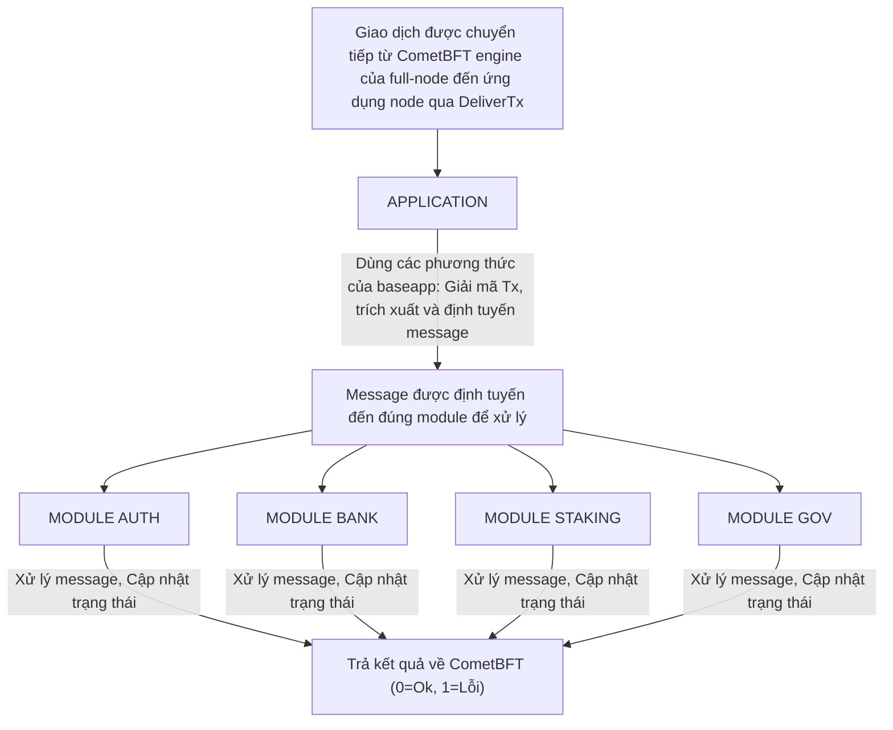

# Các Thành Phần Chính Của Cosmos SDK

Cosmos SDK là một framework tạo điều kiện cho việc phát triển các state-machine bảo mật trên CometBFT. Về cốt lõi, Cosmos SDK là một triển khai boilerplate của [ABCI](./02-sdk-app-architecture.md#abci) bằng Golang. Nó đi kèm với một [`multistore`](../advanced/04-store.md#multistore) để lưu trữ dữ liệu và một [`router`](../advanced/00-baseapp.md#routing) để xử lý giao dịch.

Dưới đây là góc nhìn đơn giản hóa về cách giao dịch được xử lý bởi một ứng dụng được xây dựng trên Cosmos SDK khi được CometBFT chuyển qua `DeliverTx`:

1. Giải mã `transactions` (giao dịch) nhận từ CometBFT consensus engine (nhớ rằng CometBFT chỉ làm việc với `[]bytes`).
2. Trích xuất `messages` (message) từ `transactions` và thực hiện các kiểm tra cơ bản.
3. Định tuyến mỗi message đến module thích hợp để được xử lý.
4. Commit các thay đổi trạng thái.

## `baseapp`

`baseapp` là triển khai boilerplate của một ứng dụng Cosmos SDK. Nó đi kèm với triển khai ABCI để xử lý kết nối với consensus engine bên dưới. Thông thường, một ứng dụng Cosmos SDK mở rộng `baseapp` bằng cách nhúng nó vào [`app.go`](../beginner/00-app-anatomy.md#core-application-file).

Đây là ví dụ từ `simapp`, ứng dụng demo của Cosmos SDK:

```go reference
https://github.com/cosmos/cosmos-sdk/blob/v0.53.0/simapp/app.go#L137-L180
```

Mục tiêu của `baseapp` là cung cấp một giao diện bảo mật giữa store và state machine có thể mở rộng, trong khi định nghĩa càng ít về state machine càng tốt (trung thành với ABCI).

Để biết thêm về `baseapp`, vui lòng nhấp [vào đây](../advanced/00-baseapp.md).

## Multistore

Cosmos SDK cung cấp một [`multistore`](../advanced/04-store.md#multistore) để lưu trữ trạng thái bền vững. Multistore cho phép các nhà phát triển khai báo bất kỳ số lượng [`KVStore`](../advanced/04-store.md#base-layer-kvstores) nào. Các `KVStore` này chỉ chấp nhận kiểu `[]byte` làm giá trị và do đó bất kỳ cấu trúc tùy chỉnh nào đều cần được marshal bằng [codec](../advanced/05-encoding.md) trước khi được lưu.

Lớp trừu tượng multistore được dùng để chia trạng thái thành các ngăn riêng biệt, mỗi ngăn được quản lý bởi module của nó. Để biết thêm về multistore, nhấp [vào đây](../advanced/04-store.md#multistore).

## Các Module

Sức mạnh của Cosmos SDK nằm ở tính module của nó. Các ứng dụng Cosmos SDK được xây dựng bằng cách tổng hợp một tập hợp các module có thể tương tác với nhau. Mỗi module định nghĩa một tập con của trạng thái và chứa bộ xử lý message/giao dịch riêng, trong khi Cosmos SDK chịu trách nhiệm định tuyến mỗi message đến module tương ứng của nó.

Dưới đây là góc nhìn đơn giản hóa về cách một giao dịch được xử lý bởi ứng dụng của mỗi full-node khi nó được nhận trong một block hợp lệ:



Mỗi module có thể được coi là một state-machine nhỏ. Các nhà phát triển cần định nghĩa tập con trạng thái được module xử lý, cũng như các kiểu message tùy chỉnh sửa đổi trạng thái (*Lưu ý:* các `message` được trích xuất từ `transactions` bởi `baseapp`). Nói chung, mỗi module khai báo `KVStore` riêng của mình trong `multistore` để lưu trữ tập con trạng thái mà nó định nghĩa. Hầu hết các nhà phát triển sẽ cần truy cập các module của bên thứ ba khác khi xây dựng module của mình. Vì Cosmos SDK là một framework mở, một số module có thể độc hại, điều đó có nghĩa là cần có các nguyên tắc bảo mật để suy luận về tương tác giữa các module. Các nguyên tắc này dựa trên [object-capability](../advanced/10-ocap.md). Trong thực tế, điều này có nghĩa là thay vì mỗi module giữ danh sách kiểm soát truy cập cho các module khác, mỗi module triển khai các đối tượng đặc biệt gọi là `keeper` có thể được truyền cho các module khác để cấp một tập hợp capabilities được định nghĩa trước.

Các module Cosmos SDK được định nghĩa trong thư mục `x/` của Cosmos SDK. Một số module cốt lõi bao gồm:

* `x/auth`: Dùng để quản lý tài khoản và chữ ký.
* `x/bank`: Dùng để bật token và chuyển token.
* `x/staking` + `x/slashing`: Dùng để xây dựng các blockchain Proof-of-Stake.

Ngoài các module đã có sẵn trong `x/` mà bất kỳ ai cũng có thể sử dụng trong ứng dụng của họ, Cosmos SDK cho phép bạn xây dựng các module tùy chỉnh của riêng mình. Bạn có thể xem [ví dụ về điều đó trong tutorial](https://tutorials.cosmos.network/).
